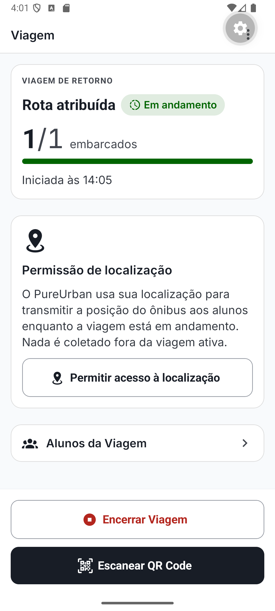
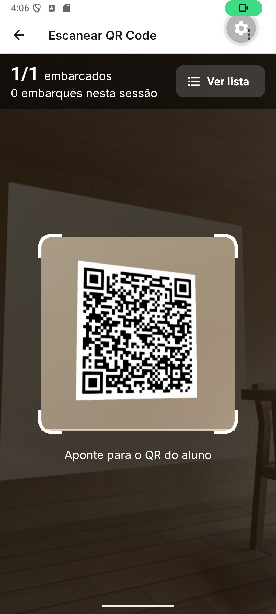
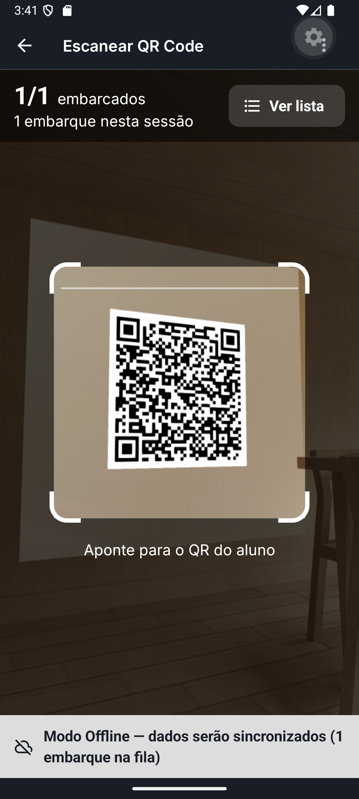
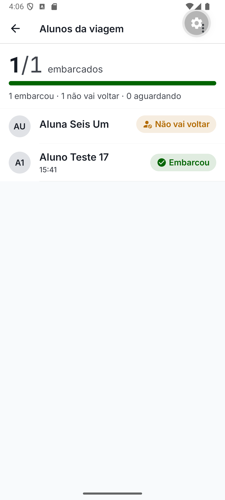
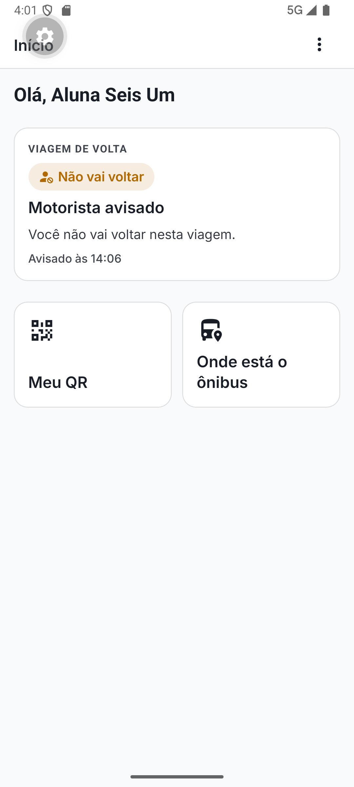
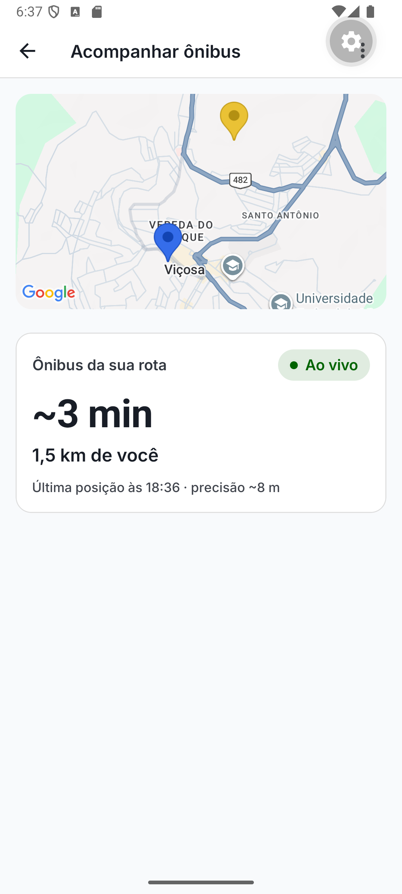
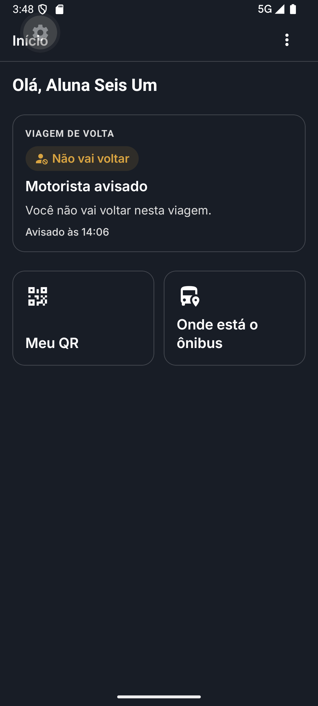

# PureUrban

**Embarque digital para o transporte universitário intermunicipal.**

Todo dia, alunos de cidades do interior pegam o ônibus fretado pela prefeitura ou por uma
empresa de transporte para estudar em outra cidade. O controle de quem embarcou é feito com
carteirinha de papel, e a comunicação acontece num grupo de WhatsApp. Quando um aluno volta
por conta própria e não avisa, o motorista espera por ele de 30 a 60 minutos.

O PureUrban troca a carteirinha por um QR Code, põe o aviso "não vou voltar" a um toque do
aluno e mostra no mapa onde o ônibus está. Motorista e aluno usam o mesmo app, e cada um vê
as telas do seu papel.

> Projeto de Trabalho de Conclusão de Curso em Engenharia de Software. O foco acadêmico é a
> arquitetura do backend: Arquitetura Hexagonal, DDD e *Functional Core, Imperative Shell*
> com Effect TS dentro do NestJS.

---

## O app

### Motorista

<table>
  <tr>
    <td align="center" width="25%"><br><sub><b>Viagem em andamento</b><br>embarcados em tempo real</sub></td>
    <td align="center" width="25%"><br><sub><b>Escanear QR</b><br>check-in em menos de 5 s</sub></td>
    <td align="center" width="25%"><br><sub><b>Sem sinal</b><br>o embarque entra na fila e sincroniza depois</sub></td>
    <td align="center" width="25%"><br><sub><b>Alunos da viagem</b><br>quem embarcou e quem não volta</sub></td>
  </tr>
</table>

### Aluno

<table>
  <tr>
    <td align="center" width="25%"><br><sub><b>Início</b><br>"não vou voltar" avisa o motorista na hora</sub></td>
    <td align="center" width="25%"><br><sub><b>Meu QR Code</b><br>substitui a carteirinha</sub></td>
    <td align="center" width="25%"><br><sub><b>Acompanhar ônibus</b><br>posição ao vivo e tempo de chegada</sub></td>
    <td align="center" width="25%"><br><sub><b>Tema escuro</b><br>segue o sistema operacional</sub></td>
  </tr>
</table>

## Funcionalidades

| Área | O que entrega |
|---|---|
| **Identidade e organização** | Cadastro de empresa, login com JWT e refresh token, gestão de motoristas, alunos, rotas e vínculos aluno↔rota e motorista↔rota. Todos os dados são isolados por empresa (multi-tenant). |
| **Viagens** | O motorista inicia e encerra viagens de ida e de retorno na rota atribuída a ele. |
| **Embarque digital** | O aluno mostra o QR Code e o motorista escaneia pela câmera. O check-in é idempotente (`X-Idempotency-Key`), então um mesmo embarque nunca é contado duas vezes. |
| **Modo offline** | Sem conexão, os check-ins entram numa fila local em SQLite e são reenviados com backoff exponencial quando a rede volta. As leituras continuam disponíveis pelo cache persistido. |
| **Ausência** | O aluno avisa que não volta, e pode cancelar o aviso dentro do prazo de segurança. O motorista recebe o aviso na hora via SSE. Um lembrete automático alerta sobre check-ins pendentes. |
| **Localização em tempo real** | O app do motorista transmite o GPS durante a viagem, e o aluno vê o ônibus e a própria posição no mapa, com distância e tempo estimado. Quando o sinal cai, a tela mostra que a posição está desatualizada. |

## Arquitetura

```
PureUrban
├── api/      NestJS 11 + Effect TS + Prisma 7 (PostgreSQL 16, Redis 7)
├── mobile/   Expo SDK 55 + React Native 0.83 + Expo Router
└── docs/     PRD, documento de arquitetura, fundamentação teórica do TCC
```

**Backend: monolito modular hexagonal.** Cada bounded context (`auth`, `routing`, `trip`,
`boarding`, `tracking`) é dividido em duas camadas:

- **`core/`**: lógica de domínio pura em Effect TS. Os use cases retornam
  `Effect<A, E, R>` com erros tagueados, sem `throw` e sem nenhum import de NestJS. Por isso
  os testes do core rodam sem banco, sem HTTP e sem container de injeção de dependência.
- **`shell/`**: controllers HTTP, DTOs e adapters Prisma/Redis que implementam os ports do
  core. É a única camada que conhece o NestJS.

Cada bounded context tem o próprio schema no PostgreSQL (`auth`, `routing`, `trip`,
`boarding`, `tracking`), e não há JOINs entre eles. Os eventos de domínio saem do core e
são despachados pelo shell. O tempo real usa SSE, e o Redis Pub/Sub distribui as mensagens
entre instâncias.

**Mobile: offline-first em duas camadas.** As leituras usam TanStack Query com cache
persistido em MMKV. As escritas críticas, que são os check-ins, passam por uma fila durável
em expo-sqlite. O tema claro e o escuro são derivados de uma paleta única, e um teste de
guarda impede cores fixas fora dela.

A documentação completa está em [`docs/Architecture.md`](docs/Architecture.md) e em
[`docs/Fundamentacao-Teorica-TCC.md`](docs/Fundamentacao-Teorica-TCC.md).

## Como rodar

Pré-requisitos: **Node 22** (`api/.nvmrc`), Docker e npm. `api/` e `mobile/` são projetos
independentes, então rode cada comando dentro do diretório correspondente.

```bash
# 1. Infra: PostgreSQL 16 (5432) + Redis 7 (6379)
docker compose up -d

# 2. API em http://localhost:3000 (Swagger em /api)
cd api
npm install
cp .env.example .env        # preencha JWT_SECRET (o comando para gerar está no arquivo)
npx prisma migrate deploy && npx prisma generate
npm run seed                # empresa "PureUrban Dev" + admin@pureurban.dev / admin123456
npm run start:dev

# 3. App no navegador em http://localhost:8081
cd ../mobile
npm install
cp .env.example .env
npm run web
```

Para rodar no Android, use o **development build**. O Expo Go não funciona, porque o app
depende de MMKV (Nitro Modules). O passo a passo, os mocks MSW para rodar sem backend e o
roteiro de verificação nativa estão em [`mobile/README.md`](mobile/README.md).

## Testes

| Onde | Comando | O que cobre |
|---|---|---|
| `api/` | `npm test` | Unitários em Vitest, com o core testado sem infraestrutura |
| `api/` | `npm run test:e2e` | E2E com NestJS e banco real (exige `docker compose up`) |
| `api/` | `npm run test:pw:api` / `test:pw:e2e` | Playwright: API sem browser e fluxos completos no Chrome |
| `mobile/` | `npm test` | Jest com jest-expo e Testing Library, sem device nem rede |

## Stack

**Backend:** NestJS 11 · TypeScript 5.7 · Effect TS · Prisma 7 (multi-schema) · PostgreSQL 16 ·
Redis 7 · JWT · SSE · OpenAPI/Swagger · Vitest · Playwright

**Mobile:** Expo SDK 55 · React Native 0.83 · React 19 (React Compiler) · Expo Router ·
React Native Paper · TanStack Query · MMKV · expo-sqlite · expo-camera · react-native-maps

## Documentação

| Documento | Conteúdo |
|---|---|
| [`docs/PRD.md`](docs/PRD.md) | Requisitos do produto: personas, jornadas, requisitos funcionais e não funcionais |
| [`docs/Architecture.md`](docs/Architecture.md) | Documento de arquitetura de software |
| [`docs/Fundamentacao-Teorica-TCC.md`](docs/Fundamentacao-Teorica-TCC.md) | Base teórica: Hexagonal, DDD, Functional Core/Imperative Shell |
| [`DESIGN.md`](DESIGN.md) | Sistema visual: paleta, tipografia e componentes |
| [`_bmad-output/`](_bmad-output/) | Planejamento BMAD: epics, stories, retrospectivas e status do sprint |

## Processo

O projeto foi desenvolvido com o método **BMAD**, com PRD, arquitetura, epics e stories
versionados no repositório, e com agentes de IA como parte do fluxo. Foram 7 epics
entregues, cada story em uma branch própria, com commits atômicos, code review e pull
request. Em `_bmad-output/implementation-artifacts/sprint-status.yaml` está o histórico
completo das stories, com as decisões e as pendências de cada uma.
